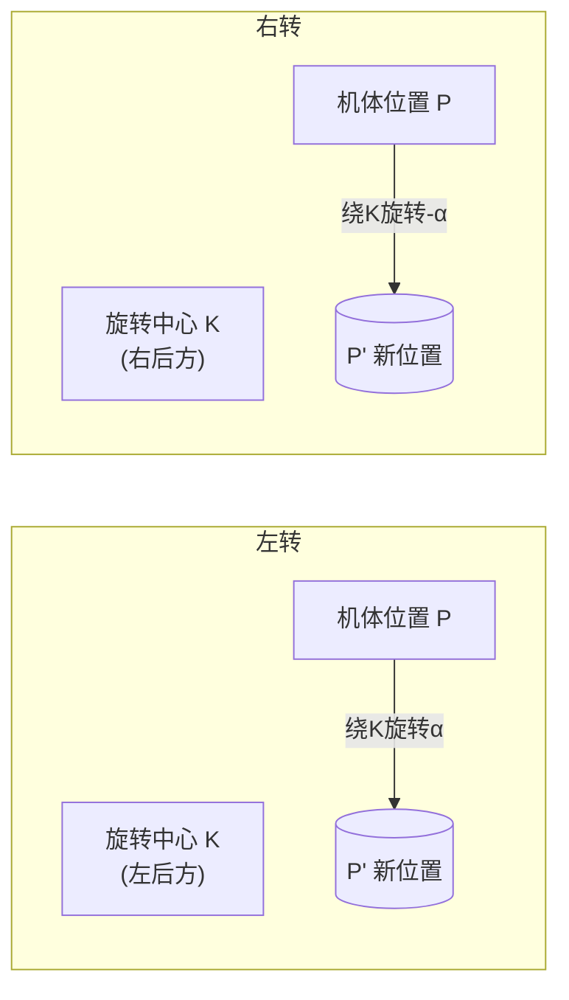

# RoboTrack 寻路算法设计文档

## 1. 任务概述

### 1.1 比赛任务

机器人从入口（`x=0, 0≤y≤40`）出发，沿规定线路行进至出口（`x=100, 0≤y≤40`），途中完成四次直角转弯。赛道为 **100cm × 100cm** 正方形，内含三堵不可通行墙壁：

| 墙壁 | 区域（cm） | 说明 |
|------|-----------|------|
| 左墙 | `0≤x≤5, 40≤y≤100` | 入口左侧 |
| 中墙 | `45≤x≤55, 0≤y≤60` | 赛道中央 |
| 右墙 | `95≤x≤100, 40≤y≤100` | 出口右侧 |

外框底边（`y=0`）和顶边（`y=100`）同样不可通行，出入口区域为开口。

### 1.2 评分标准（总分 100 分）

| 项目 | 分值 |
|------|------|
| 完整走完全程 | +40 |
| 准确停靠指定点位（共 4 处） | +15 × 4 |
| 蹭墙/撞击墙壁 | 单次 −5 |
| 机器人摔倒、人工介入 | 单次 −10 |

### 1.3 目标点

机器人需依次到达 4 个停靠点（各停留 3 秒）和 4 个转向点（不停留），最后开环走出出口。

| 编号 | 停靠点坐标 | 转向点坐标 | 目标朝向 |
|------|-----------|-----------|---------|
| 1 | `[14.7, 21.3]` | `[20.0, 21.3]` | `[1, 0]`（东） |
| 2 | `[23.1, 70]` | `[23.1, 70]` | `[0, 1]`（北） |
| 3 | `[65, 79.7]` | `[65, 79.7]` | `[1, 0]`（东） |
| 4 | `[74, 30]` | `[74, 30]` | `[0, -1]`（南） |

### 1.4 AprilTag 标签位置

赛道四角各贴一张 AprilTag（tag36h11 族），用于视觉定位：

| Tag ID | 位置 | 所在墙面 |
|--------|------|---------|
| 36 | `x=44.7, y=18.8~23.8, z=36.5~41.5` | 中墙右侧 |
| 37 | `x=20.6~25.6, y=100, z=36.7~41.7` | 顶墙 |
| 38 | `x=95, y=77.2~82.2, z=36.7~41.7` | 右墙 |
| 39 | `x=71.5~76.5, y=0, z=37.1~42.1` | 底墙 |

---

## 2. 系统架构

### 2.1 硬件平台

- **机器人**：Hiwonder TonyPi（树莓派 + 舵机驱动板）
- **摄像头**：USB 摄像头，通过 `fswebcam` 拍摄静态照片（2592×1944）
- **动作系统**：TonyPi 动作组框架（`.d6a` 文件），通过 `AGC.runActionGroup()` 同步阻塞调用

### 2.2 软件模块

```
goodluck.py
├── 赛道数据定义（tag_poses, WALLS, stand_poses, target_poses）
├── 决策算法常量（阈值、动作参数）
├── 硬件 I/O 层
│   ├── run_action()          — 执行动作组
│   ├── set_head()            — 转动头部舵机
│   ├── capture_image()       — 拍照
│   └── detect_apriltag()     — AprilTag 检测
├── 视觉定位层
│   ├── solve_pnp()           — PnP 位姿求解
│   ├── compensate_head_offset() — 头部偏转补偿
│   ├── locate_with_scan()    — 三级头部扫描定位
│   └── locate_with_retry()   — 定位重试机制
├── 避障与导航决策层
│   ├── distance_to_walls()   — 墙距计算
│   ├── nearest_safe_point()  — 安全点搜索
│   ├── decide_panning_action() — 贪心平移决策
│   ├── decide_rotation_action() — 转向决策
│   └── navigate_to_target()  — 导航主循环
└── 主流程
```

### 2.3 模拟器架构（goodluck_sim.py）

模拟器采用 **PART A / PART B 分离架构**：

- **PART A**：`goodluck.py` 的逐字副本（算法部分），硬件导入用 `try/except` 包裹
- **PART B**：模拟器逻辑，通过 monkey-patch 替换 PART A 的 I/O 函数

```
PART A（算法，不可修改）          PART B（模拟器）
┌─────────────────────┐         ┌──────────────────────┐
│ solve_pnp()         │◄────────│ sim_solve_pnp()      │
│ run_action()        │◄────────│ sim_run_action()     │
│ set_head()          │◄────────│ sim_set_head()       │
│ navigate_to_target()│         │ SimState (运动模型)   │
│ decide_*_action()   │         │ Visualizer (可视化)   │
└─────────────────────┘         └──────────────────────┘
```

**优势**：`goodluck.py` 算法更新后可直接复制到 PART A，无需修改 PART B。

---

## 3. 视觉定位算法

### 3.1 AprilTag 检测 + PnP 求解

定位的核心流程为：拍照 → AprilTag 检测 → PnP 求解 → 提取位置与朝向。

**`solve_pnp()`** 函数：

1. 使用 `fswebcam` 拍摄高分辨率照片（2592×1944）
2. 用 `apriltag` 库检测 tag36h11 族标签
3. 收集所有检测到的标签的 3D 世界坐标（`tag_poses`）和 2D 图像角点
4. 调用 `cv2.solvePnP()` 求解相机外参（`rvec`, `tvec`）
5. 从旋转向量 `rvec` 构造旋转矩阵 `R`，计算相机在世界坐标系中的位置和朝向：

$$\mathbf{P}_{\text{cam}} = -R^{-1} \cdot \mathbf{t}$$

$$\mathbf{O}_{\text{cam}} = R^{-1} \cdot (\hat{z} - \mathbf{t}) - \mathbf{P}_{\text{cam}}$$

6. 取 `x, y` 分量作为 2D 平面位置和朝向，朝向归一化为单位向量

**相机内参**：

$$K = \begin{bmatrix} 1944.9 & 0 & 1283.1 \\ 0 & 1950.1 & 983.2 \\ 0 & 0 & 1 \end{bmatrix}$$

**畸变系数**：`[-0.384, 0.285, 0, 0]`

### 3.2 头部偏转补偿

当头部舵机转动拍照时，相机随头部转动但机体不动。`solve_pnp()` 解出的是**相机朝向**，需补偿为**机体朝向**。

**`compensate_head_offset(head_pulse)`**：

1. 将舵机脉宽转换为角度：$\theta = (p - 1500) \times 0.09°$（右转为负，左转为正）
2. 用反向旋转矩阵将相机朝向转回机体坐标系：

$$\mathbf{O}_{\text{body}} = R(-\theta) \cdot \mathbf{O}_{\text{cam}}$$

$$R(-\theta) = \begin{bmatrix} \cos\theta & \sin\theta \\ -\sin\theta & \cos\theta \end{bmatrix}$$

### 3.3 三级头部扫描定位

**`locate_with_scan()`** 采用三级策略提高定位成功率：

```
头部回正(HEAD_CENTER=1500) → 拍照+PnP
    ├─ 成功 → 返回（无需补偿）
    └─ 失败 → 头部右转(HEAD_RIGHT=600) → 拍照+PnP
                ├─ 成功 → 补偿头部偏转 → 回正 → 返回
                └─ 失败 → 头部左转(HEAD_LEFT=2400) → 拍照+PnP
                            ├─ 成功 → 补偿头部偏转 → 回正 → 返回
                            └─ 失败 → 回正 → 返回 False
```

### 3.4 定位重试机制

**`locate_with_retry()`** 在头部扫描全部失败时，通过身体小幅转动改变视角：

```
for attempt in 1..MAX_LOCATE_RETRIES(5):
    locate_with_scan()
    ├─ 成功 → 返回 True
    └─ 失败 → 偶数次: turn_left_small_step
              奇数次: turn_right_small_step
→ 全部失败，返回 False
```

### 3.5 头部舵机动态等待

**`set_head(pulse)`** 根据脉宽差动态调整等待时间，避免固定等待造成的效率浪费：

$$t_{\text{wait}} = \max\left(t_{\min},\ \frac{|\Delta p|}{900} \times t_{\text{full}}\right) + 200\text{ms}$$

其中 $t_{\min} = 100\text{ms}$，$t_{\text{full}} = 500\text{ms}$，$900\mu s$ 对应 90° 满量程。

---

## 4. 避障系统

### 4.1 墙距计算

**`distance_to_walls(pos)`** 计算位置到最近障碍物的距离：

1. 对三堵矩形墙（左墙、中墙、右墙），用 `distance_point_to_rect()` 计算点到矩形的最短距离
2. 额外检查外框底边（`y=0`）和顶边（`y=100`）
3. 返回所有距离的最小值

**点到矩形距离**：对矩形 `[x_min, x_max, y_min, y_max]` 和点 `(x, y)`：

$$d = \sqrt{\max(x_{\min} - x, 0, x - x_{\max})^2 + \max(y_{\min} - y, 0, y - y_{\max})^2}$$

### 4.2 安全点搜索

当机器人进入危险区（离墙 < `OBSTACLE_THRESHOLD`）时，**`nearest_safe_point(pos)`** 搜索最近的安全点：

**搜索阈值**：

$$\text{SAFE\_THRESHOLD} = \text{OBSTACLE\_THRESHOLD} + \text{POSITION\_THRESHOLD} + \text{SAFE\_MARGIN}$$

$$= 15.0 + 3.0 + 3.0 = 21.0\text{cm}$$

> **设计原因**：若安全点离机器人太近（< `POSITION_THRESHOLD`），机器人到达后位置差异不超阈值，会跳过平移直接判定"已到达"，导致"需逃离但无需导航"的死循环。提高阈值确保安全点足够远，必触发平移动作。

**搜索策略**：16 方向螺旋搜索，步长 1cm，最大半径 100cm：

```
for step in 1..100:
    for angle in [0°, 22.5°, 45°, ..., 337.5°]:  # 16方向
        candidate = pos + step * [cos(angle), sin(angle)]
        if distance_to_walls(candidate) >= SAFE_THRESHOLD:
            return candidate
# 兜底：返回搜索范围内 distance_to_walls 最大的点
```

---

## 5. 导航决策算法

### 5.1 导航主循环

**`navigate_to_target(target_id, poses, stop_time)`** 是核心导航函数，采用 **定位 → 朝向修正 → 平移接近 → 到达检查** 的循环结构：

```
while True:
    1. 定位（locate_with_retry）
    2. 危险检测
       ├─ 离墙 < OBSTACLE_THRESHOLD → 临时目标 = nearest_safe_point()，escaping=True
       └─ 安全 → 临时目标 = target_pos，escaping=False
    3. 计算位置差异
       pd = current_position - target
       dist = |pd|
    4. 动态计算有效目标朝向 effective_orient
       ├─ escaping → None（跳过朝向修正）
       ├─ dist > ORIENT_FREEZE_DIST_CM → 连线方向（动态更新），重置 frozen
       └─ dist ≤ ORIENT_FREEZE_DIST_CM →
          ├─ 有指定朝向 → 指定朝向
          └─ 无指定(None) → 冻结进入近距离时的连线方向
    5. 朝向优先（非逃离且 |od| > ORIENTATION_THRESHOLD）
       ├─ decide_rotation_action() → 旋转
       └─ |od| ≤ 阈值 → 继续
    6. 平移接近
       ├─ dist > POSITION_THRESHOLD → decide_panning_action() → 平移
       └─ dist ≤ 阈值 → 继续
    7. 到达检查
       ├─ 逃离中 → 恢复原目标导航
       ├─ stop_time > 0 → 停留 stop_time 秒
       └─ stop_time = 0 → 不停留
       → 返回 True
```

**关键设计**：
- **朝向优先于平移**：先对准朝向再平移，避免斜向移动偏离赛道
- **逃离时跳过朝向修正**：在危险区中优先平移离开，不浪费时间转向
- **两阶段共用同一函数**：停靠点（`stop_time=3`）和转向点（`stop_time=0`）逻辑统一
- **动态朝向策略**：远距离用连线方向平滑接近，近距离切指定朝向或冻结防震荡（详见 5.4）

### 5.2 贪心平移决策

**`decide_panning_action(current_pos, target_pos, orientation)`** 模拟所有候选动作执行后的位置，选择最接近目标的：

**候选动作**（机体坐标系）：

| 动作 | 位移向量 |
|------|---------|
| `go_forward_one_step` | $+L_{\text{step}} \cdot \mathbf{O}$ |
| `go_forward_one_small_step` | $+L_{\text{small}} \cdot \mathbf{O}$ |
| `back_one_step` | $-L_{\text{back}} \cdot \mathbf{O}$ |
| `left_move` | $+L_{\text{left}} \cdot \mathbf{O}_{\perp L}$ |
| `right_move` | $+L_{\text{right}} \cdot \mathbf{O}_{\perp R}$ |

其中 $\mathbf{O}_{\perp L} = [-O_y, O_x]$（左转 90°），$\mathbf{O}_{\perp R} = [O_y, -O_x]$（右转 90°）。

**评分与选择**：

1. 对每个候选动作，计算执行后的绝对位置 `new_pos = target + new_pd`
2. **避障过滤**：`distance_to_walls(new_pos) < OBSTACLE_THRESHOLD` → 排除
3. **评分**：`score = |new_pd|`，前进方向减去偏好权重 `FORWARD_BIAS`
4. 选 `score` 最小的动作

> **前进偏好权重** `FORWARD_BIAS = 0.5`：在距离相近时优先前进，避免原地左右横移陷入震荡。

> **全部被排除时的兜底**：`navigate_to_target()` 中若 `decide_panning_action` 返回 `None`，强制执行 `back_one_step` 尝试脱离危险区。

### 5.3 转向决策

**`decide_rotation_action(orientation_diff)`** 计算当前朝向到目标朝向的带符号角度差，选择转向方向和步长：

1. **目标朝向**：$\mathbf{O}_{\text{target}} = \mathbf{O}_{\text{current}} - \mathbf{O}_{\text{diff}}$
2. **叉积判方向**：$c = O_x \cdot O_{\text{target},y} - O_y \cdot O_{\text{target},x}$
   - $c > 0$ → 左转
   - $c \leq 0$ → 右转
3. **点积算角度**：$\theta = \arccos(\mathbf{O} \cdot \mathbf{O}_{\text{target}})$
4. **步长选择**：
   - $\theta > \text{TURN\_DEG}$（30°）→ 大步转向（`turn_left` / `turn_right`）
   - $\theta \leq \text{TURN\_DEG}$ → 小步转向（`turn_left_small_step` / `turn_right_small_step`）

### 5.4 朝向差异表示与动态朝向策略

朝向差异使用**向量差**而非角度差：

$$\mathbf{O}_{\text{diff}} = \mathbf{O}_{\text{current}} - \mathbf{O}_{\text{target}}$$

阈值 `ORIENTATION_THRESHOLD = 0.26` 对应约 15°（$2\sin(15°/2) \approx 0.26$），即向量差的模长。

#### 动态朝向策略

目标朝向不再是纯静态指定，而是根据机器人到目标的距离动态计算：

| 距离 | 有效目标朝向 | 说明 |
|------|-------------|------|
| `dist > ORIENT_FREEZE_DIST_CM` | 连线方向 $-\mathbf{pd}/|\mathbf{pd}|$ | 动态更新，使转弯段斜切接近更平滑 |
| `dist ≤ ORIENT_FREEZE_DIST_CM` 且有指定朝向 | 指定朝向 | 确保停靠点评分朝向精确 |
| `dist ≤ ORIENT_FREEZE_DIST_CM` 且无指定(None) | 冻结连线方向 | 首次进入近距离时记录，之后固定不变，防震荡 |
| 逃离危险区 | None | 跳过朝向修正，优先平移离开 |

- **`ORIENT_FREEZE_DIST_CM = 6.0`**（独立常量）：冻结距离阈值。调大增强防震荡，调小扩大连线方向范围，但需 > `POSITION_THRESHOLD`(3cm)。
- **防震荡原理**：接近目标时定位噪声导致连线方向抖动（1cm 噪声在 3cm 处约 18°），冻结后方向不再随位置噪声变化，消除“定位→转向→位置不变→再定位”的循环。

---

## 6. 运动模型

### 6.1 平移动作

平移动作（前进、后退、横移）按机体坐标系直线运动：

$$\mathbf{P}' = \mathbf{P} + d \cdot \mathbf{O}$$

其中 $d$ 为位移距离（带符号），$\mathbf{O}$ 为当前朝向单位向量。

### 6.2 圆周运动转向模型

转向动作采用**圆周运动模型**，而非原地旋转。旋转中心位于机器人后方偏侧：

**旋转中心计算**：

$$\mathbf{K} = \mathbf{P} - d_{\text{cam}} \cdot \mathbf{O} + R \cdot \mathbf{O}_{\perp}$$

其中：
- $d_{\text{cam}} = \text{CAMERA\_FORWARD\_OFFSET\_CM} = 2.0\text{cm}$（旋转中心在机体后方）
- $R = \text{TURN\_LEFT\_RADIUS\_CM} = \text{TURN\_RIGHT\_RADIUS\_CM} = 5.0\text{cm}$（转弯半径）
- 左转：$\mathbf{O}_{\perp} = [-O_y, O_x]$（圆心在左后方）
- 右转：$\mathbf{O}_{\perp} = [O_y, -O_x]$（圆心在右后方）

**位置和朝向更新**：

$$\mathbf{P}' = \mathbf{K} + R(\alpha) \cdot (\mathbf{P} - \mathbf{K})$$

$$\mathbf{O}' = R(\alpha) \cdot \mathbf{O}$$

其中 $R(\alpha)$ 为旋转矩阵：

$$R(\alpha) = \begin{bmatrix} \cos\alpha & -\sin\alpha \\ \sin\alpha & \cos\alpha \end{bmatrix}$$

$\alpha$ 为转向角度（左转正、右转负）。



---

## 7. 主流程

### 7.1 全程流程

```
stand（站立初始化）
set_head(HEAD_CENTER)（头部回正）
for tid in ["1", "2", "3", "4"]:
    navigate_to_target(tid, stand_poses, STOP_TIME=3)   # 停靠阶段
    navigate_to_target(tid, target_poses, 0)             # 转向阶段
# 开环走出出口
go_forward × 3
turn_left × 3
go_forward × 6
stand
```

### 7.2 两阶段导航设计

每个目标点分为两个阶段：

| 阶段 | 目标 | 停留 | 用途 |
|------|------|------|------|
| 停靠阶段 | `stand_poses[tid]` | 3 秒 | 到达评分点，裁判确认 |
| 转向阶段 | `target_poses[tid]` | 0 秒 | 移动到转向起始位置 |

> **设计原因**：停靠点和转向点分离，使得机器人可以在停靠评分后移动到更合适的转向位置，提高转弯成功率。

### 7.3 开环出口

第 4 个转向点完成后，采用开环动作走出出口（不再定位）：

```
go_forward × 3   → 前进约 12cm
turn_left × 3    → 左转约 90°
go_forward × 6   → 前进约 24cm
stand            → 站立结束
```

---

## 8. 决策常量汇总

### 8.1 阈值参数

| 常量 | 值 | 说明 |
|------|-----|------|
| `ORIENTATION_THRESHOLD` | 0.19 | 朝向差异模长阈值（≈11°） |
| `POSITION_THRESHOLD` | 3.0 cm | 位置差异模长阈值 |
| `OBSTACLE_THRESHOLD` | 15.0 cm | 避障容忍阈值 |
| `SAFE_MARGIN_CM` | 3.0 cm | 安全点额外余量 |
| `PANNING_ANGLE_THRESHOLD` | 30.0° | 平移与转向切换角度阈值 |
| `MAX_LOCATE_RETRIES` | 5 | 定位失败最大重试次数 |
| `STOP_TIME` | 3 s | 停靠点停留时间 |

### 8.2 动作参数

| 常量 | 值 | 说明 |
|------|-----|------|
| `FORWARD_ONE_STEP_CM` | 4.0 cm | 单步前进距离 |
| `FORWARD_ONE_SMALL_STEP_CM` | 2.0 cm | 小步前进距离 |
| `BACK_ONE_STEP_CM` | 4.0 cm | 单步后退距离 |
| `LEFT_MOVE_CM` | 2.9 cm | 左移距离 |
| `RIGHT_MOVE_CM` | 2.1 cm | 右移距离 |
| `TURN_LEFT_DEG` | 30.0° | 左转角度 |
| `TURN_RIGHT_DEG` | 30.0° | 右转角度 |
| `TURN_LEFT_SMALL_STEP_DEG` | 21.0° | 小步左转角度 |
| `TURN_RIGHT_SMALL_STEP_DEG` | 21.0° | 小步右转角度 |
| `FORWARD_BIAS` | 0.5 | 前进方向偏好权重 |

### 8.3 运动模型参数

| 常量 | 值 | 说明 |
|------|-----|------|
| `CAMERA_FORWARD_OFFSET_CM` | 2.0 cm | 旋转中心相对机体的后偏移 |
| `TURN_LEFT_RADIUS_CM` | 5.0 cm | 左转圆周运动半径 |
| `TURN_RIGHT_RADIUS_CM` | 5.0 cm | 右转圆周运动半径 |

### 8.4 头部舵机参数

| 常量 | 值 | 说明 |
|------|-----|------|
| `HEAD_CENTER` | 1500 | 头部中位脉宽 |
| `HEAD_RIGHT` | 600 | 头部右转脉宽 |
| `HEAD_LEFT` | 2400 | 头部左转脉宽 |
| `HEAD_MOVE_TIME_MS` | 500 ms | 满量程转动等待时间 |
| `HEAD_MOVE_TIME_MIN_MS` | 100 ms | 最小转动等待时间 |
| `SERVO_DEG_PER_US` | 0.09 | 脉宽→角度转换系数 |

---

## 9. 模拟器设计

### 9.1 模拟器功能

`goodluck_sim.py` 提供完整的算法验证环境：

- **运动模拟**：`SimState` 类模拟机器人位置、朝向、轨迹
- **可视化**：`Visualizer` 类实时绘制赛道、机器人、轨迹
- **噪声注入**：可配置定位噪声、动作误差、转向误差
- **边界框显示**：以几何中心为中心的 10×26cm 浅红色半透明矩形，随朝向旋转
- **实时计时**：每个动作配置耗时，累计显示总用时
- **日志输出**：`TeeWriter` 同时输出到终端和文件
- **轨迹保存**：`save_trajectory_png()` 保存最终轨迹图

### 9.2 模拟器配置常量

以下常量位于 `goodluck_sim.py` PART B 配置区（约 L610-L645），可直接修改后运行：

| 常量 | 默认值 | 说明 |
|------|--------|------|
| `LOCATE_NOISE_STD` | 1.0 cm | 定位位置噪声标准差，0=无噪声 |
| `LOCATE_ANGLE_NOISE_STD` | 5.0° | 定位朝向噪声标准差，0=无噪声 |
| `ACTION_ERROR_STD` | 0.1 | 动作步长误差比例（0.1=±10%），0=无误差 |
| `TURN_ERROR_STD` | 5.0° | 转向角度误差标准差，0=无误差 |
| `ANIM_PAUSE_SEC` | 1.0 s | 每步动画刷新间隔，0=不暂停 |
| `MAX_SIM_STEPS` | 500 | 模拟最大动作步数，防止算法不收敛时无限循环 |
| `ROBOT_WIDTH_CM` | 26.0 cm | 机器人边界框宽（cm） |
| `ROBOT_LENGTH_CM` | 10.0 cm | 机器人边界框长（cm） |
| `LOG_TO_FILE` | True | 是否同时输出日志到文件 |
| `INITIAL_POS` | `[2.0, 20.0]` | 机器人初始位置 |
| `INITIAL_ORIENTATION` | `[1.0, 0.0]` | 机器人初始朝向（东） |

> **注意**：边界框以几何中心为中心，`ROBOT_LENGTH_CM` 沿朝向方向，`ROBOT_WIDTH_CM` 垂直于朝向方向。

### 9.3 动作耗时配置

```python
ACTION_TIME_SEC = {
    "stand": 1.0,
    "go_forward_one_step": 1.0,
    "go_forward_one_small_step": 0.8,
    "go_forward": 1.0,
    "back_one_step": 1.0,
    "back": 1.0,
    "left_move": 1.2,
    "right_move": 1.2,
    "turn_left": 1.5,
    "turn_left_small_step": 0.8,
    "turn_right": 1.5,
    "turn_right_small_step": 0.8,
}
```

### 9.4 输出文件

每次运行自动在 `result/` 子目录下生成带时间戳的文件：

| 文件 | 命名格式 | 内容 |
|------|---------|------|
| 轨迹图 | `result/trajectory_YYYYMMDD_HHMMSS.png` | 完整赛道 + 最终轨迹 + 终点姿态 |
| 日志文件 | `result/simulation_log_YYYYMMDD_HHMMSS.txt` | 全部终端输出（含定位、决策、耗时） |

### 9.5 死循环防护

模拟器内置两层防护：

1. **`MAX_SIM_STEPS = 500`**：动作步数超限时抛出 `RuntimeError`
2. **`locate_count` 死循环检测**：同一位置连续定位超限时中止

---

## 10. 使用指南

### 10.1 快速开始

#### 运行模拟器

```bash
# 交互模式（TkAgg 后端，实时动画）
python goodluck_sim.py

# 无界面模式（Agg 后端，仅生成文件）
# Windows PowerShell:
$env:MPLBACKEND="Agg"; python goodluck_sim.py
# Linux/macOS:
MPLBACKEND=Agg python goodluck_sim.py
```

运行后自动生成：
- `result/trajectory_*.png` — 轨迹图
- `result/simulation_log_*.txt` — 完整日志

#### 部署到机器人

将 `goodluck.py` 复制到机器人上运行即可，无需修改：
```bash
python goodluck.py
```

### 10.2 可调常量总览

算法和模拟器中所有可调常量按功能分为三类：

#### ① 算法决策常量（`goodluck.py`，同时影响模拟器）

这些常量在 `goodluck.py` 顶部定义，复制到 PART A 后模拟器自动生效：

| 常量 | 默认值 | 作用 | 调参建议 |
|------|--------|------|---------|
| `ORIENTATION_THRESHOLD` | 0.19 | 朝向对齐容差（≈11°） | 值越小精度越高但步数越多 |
| `POSITION_THRESHOLD` | 3.0 cm | 位置到达容差 | 值越小越精确但可能震荡 |
| `OBSTACLE_THRESHOLD` | 15.0 cm | 避障安全距离 | 赛道窄处需调小，宽处可调大 |
| `SAFE_MARGIN_CM` | 3.0 cm | 安全点额外余量 | 防死循环，一般不改 |
| `FORWARD_BIAS` | 0.5 | 前进方向偏好权重 | 值越大越倾向前进 |
| `MAX_LOCATE_RETRIES` | 5 | 定位失败重试次数 | 视环境光照调整 |
| `STOP_TIME` | 3 s | 停靠点停留时间 | 比赛规则要求 3 秒 |

#### ② 动作参数常量（`goodluck.py`，需实机标定）

这些常量描述每个动作执行后的实际位移/角度，**必须实机标定**后填入：

| 常量 | 默认值 | 对应动作 | 标定方法 |
|------|--------|---------|---------|
| `FORWARD_ONE_STEP_CM` | 4.0 cm | `go_forward_one_step` | 标记起止点量距 |
| `FORWARD_ONE_SMALL_STEP_CM` | 2.0 cm | `go_forward_one_small_step` | 标记起止点量距 |
| `BACK_ONE_STEP_CM` | 4.0 cm | `back_one_step` | 标记起止点量距 |
| `LEFT_MOVE_CM` | 2.9 cm | `left_move` | 标记起止点量距 |
| `RIGHT_MOVE_CM` | 2.1 cm | `right_move` | 标记起止点量距 |
| `TURN_LEFT_DEG` | 30.0° | `turn_left` | 量角器测转角 |
| `TURN_RIGHT_DEG` | 30.0° | `turn_right` | 量角器测转角 |
| `TURN_LEFT_SMALL_STEP_DEG` | 21.0° | `turn_left_small_step` | 量角器测转角 |
| `TURN_RIGHT_SMALL_STEP_DEG` | 21.0° | `turn_right_small_step` | 量角器测转角 |
| `CAMERA_FORWARD_OFFSET_CM` | 2.0 cm | 转向模型：旋转中心后偏 | 观察转弯轨迹反推 |
| `TURN_LEFT_RADIUS_CM` | 5.0 cm | 转向模型：左转半径 | 观察转弯轨迹反推 |
| `TURN_RIGHT_RADIUS_CM` | 5.0 cm | 转向模型：右转半径 | 观察转弯轨迹反推 |

#### ③ 模拟器配置常量（仅 `goodluck_sim.py` PART B）

这些常量仅影响模拟行为，不影响实机运行：

| 常量 | 默认值 | 作用 |
|------|--------|------|
| `LOCATE_NOISE_STD` | 1.0 cm | 定位位置噪声 σ |
| `LOCATE_ANGLE_NOISE_STD` | 5.0° | 定位朝向噪声 σ |
| `ACTION_ERROR_STD` | 0.1 | 动作步长误差比例 |
| `TURN_ERROR_STD` | 5.0° | 转向角度误差 σ |
| `ANIM_PAUSE_SEC` | 1.0 s | 动画每步暂停时间 |
| `MAX_SIM_STEPS` | 500 | 最大步数上限 |
| `ROBOT_WIDTH_CM` | 26.0 cm | 边界框宽 |
| `ROBOT_LENGTH_CM` | 10.0 cm | 边界框长 |
| `LOG_TO_FILE` | True | 日志写入文件 |
| `INITIAL_POS` | `[2.0, 20.0]` | 初始位置 |
| `INITIAL_ORIENTATION` | `[1.0, 0.0]` | 初始朝向 |

### 10.3 噪声模拟

模拟器支持四种独立噪声，用于测试算法鲁棒性：

```python
# PART B 配置区（goodluck_sim.py 约第 610 行）
LOCATE_NOISE_STD = 1.0          # 定位位置噪声：每次定位结果加 N(0, 1.0) cm
LOCATE_ANGLE_NOISE_STD = 5.0    # 定位朝向噪声：每次朝向加 N(0, 5.0)°
ACTION_ERROR_STD = 0.1          # 动作误差：实际位移 × (1 + N(0, 0.1))
TURN_ERROR_STD = 5.0            # 转向误差：实际角度 + N(0, 5.0)°
```

**典型测试场景**：

| 场景 | 配置 | 用途 |
|------|------|------|
| 理想验证 | 全部设为 0 | 验证算法逻辑正确性 |
| 轻度噪声 | `LOCATE_NOISE_STD=0.5, TURN_ERROR_STD=2.0` | 模拟良好环境 |
| 中度噪声 | `LOCATE_NOISE_STD=1.0, TURN_ERROR_STD=5.0`（默认） | 模拟真实环境 |
| 重度噪声 | `LOCATE_NOISE_STD=2.0, TURN_ERROR_STD=10.0` | 压力测试 |

### 10.4 算法更新流程

当修改了 `goodluck.py` 中的算法逻辑后，同步到模拟器：

1. 打开 `goodluck_sim.py`
2. 找到 `# ===== PART A` 标记（约第 30 行）
3. 将 `goodluck.py` 中 `# |||||||||||||||||||||||||||||||||||||||||||||||||||||||||||||||||||||` 标记之间的代码复制粘贴覆盖 PART A
4. 运行 `python goodluck_sim.py` 验证

> **关键**：只需替换 PART A（算法部分），PART B（模拟器）无需任何修改。monkey-patch 机制会自动将算法中的 `run_action()`、`solve_pnp()`、`set_head()` 重定向到模拟器桩函数。

### 10.5 可视化功能

模拟器运行时实时显示：

- **赛道静态层**：墙壁（灰色矩形）、4 个停靠点（红点）、4 个转向点（蓝点）、AprilTag 位置（绿点）
- **机器人动态层**：
  - 紫色箭头 — 位置与朝向
  - 浅红色半透明矩形 — 机器人边界框（`ROBOT_WIDTH_CM × ROBOT_LENGTH_CM`），随朝向旋转
  - 青色折线 — 历史轨迹
  - 左上角文字框 — 当前动作、位置、朝向、已用时间

### 10.6 日志分析

日志文件（`result/simulation_log_*.txt`）包含完整运行记录：

```
[log] 日志同时输出到文件: result/simulation_log_20260730_225823.txt
============================================================
寻路算法模拟器启动
噪声配置: 定位位置σ=1.0cm, 定位朝向σ=5.0°, ...
============================================================
...
===== 开始导航至停靠点 1 =====
目标坐标：[14.7 21.3]，目标朝向：[1. 0.]
--- 定位尝试 1/5 ---
定位成功（头部回正）。位置： [ 2. 20.] 朝向： [1. 0.]
...
===== 全程完成 =====
[save_trajectory_png] 轨迹图已保存: result/trajectory_20260730_225823.png

总耗时: 74.7s  总动作步数: 68
模拟结束。
[log] 日志已保存: result/simulation_log_20260730_225823.txt
```

**关键指标**：
- `总耗时` — 所有动作耗时之和（`ACTION_TIME_SEC` 累加）
- `总动作步数` — 执行的动作总数
- `定位尝试 N/5` — 每次定位的重试次数（多次说明环境困难）
- `离墙 X.XXcm < 15.0cm，排除` — 避障过滤记录

---

## 11. 已知问题与解决方案

### 11.1 平移决策符号错误（已修复）

**问题**：`decide_panning_action` 中 `position_diff` 计算为 `current_pos - target_pos`，但候选动作位移向量使用 `+` 号，导致方向错误。

**修复**：候选动作应使用 `position_diff + displacement`（因为 `position_diff` 已是 `current - target`，加上位移后得到新的 `new_pos - target`）。

### 11.2 危险区死循环（已修复）

**问题**：机器人在 `[14, 30]` 位置离墙 13.45cm（< 15cm 阈值），触发安全点搜索。安全点 `[14, 28]` 仅 2cm 远（< `POSITION_THRESHOLD = 3.0`），机器人到达后位置差异不超阈值，跳过平移直接判定"已到达"，恢复原目标导航后再次进入危险区，形成死循环。

**修复**：将 `nearest_safe_point` 的搜索阈值从 `OBSTACLE_THRESHOLD` 提高到 `OBSTACLE_THRESHOLD + POSITION_THRESHOLD + SAFE_MARGIN_CM = 21.0cm`，确保安全点足够远，必触发平移动作。

### 11.3 动作参数待标定

以下参数为估算值，需实机标定：

- `FORWARD_ONE_STEP_CM`、`FORWARD_ONE_SMALL_STEP_CM`：实际前进距离
- `LEFT_MOVE_CM`、`RIGHT_MOVE_CM`：实际横移距离
- `TURN_LEFT_DEG`、`TURN_RIGHT_DEG`：实际转向角度
- `CAMERA_FORWARD_OFFSET_CM`：旋转中心偏移
- `TURN_LEFT_RADIUS_CM`、`TURN_RIGHT_RADIUS_CM`：转弯半径

---

## 12. 时间优化方向

基于最新模拟日志（噪声模式：定位 σ=1.0cm / 朝向 σ=5.0° / 动作误差 10% / 转向误差 5°），当前全程 **84.0s / 81 步**。时间消耗分布如下：

| 类别 | 估算步数 | 估算耗时 | 占比 |
|------|---------|---------|------|
| 前进类（`go_forward_one_step` / `small_step`） | ~35 步 | ~35s | 42% |
| 转向类（`turn_left` / `right` + `small_step`） | ~15 步 | ~18s | 21% |
| 横移 / 后退（避障逃离） | ~8 步 | ~9s | 11% |
| 开环出口 | 12 步 | ~12s | 14% |
| `stand` + 停留 | 10 步 | ~12s | 14% |

> 停留 3s × 4 = 12s 为比赛规则要求，不可压缩。

以下优化方向按预期收益排序：

### 12.1 多步连续前进（安全区跳过定位）— 预计省 20-30s ⭐最大收益

**问题**：当前每走一步就定位一次。日志显示停靠点 2 的长直道（y=20→70，50cm 距离）走了约 12 步，每步都拍照定位，共 12 次定位开销。

**方案**：当目标方向与朝向对齐、且前方安全距离充足时，连续前进 N 步再定位：

```python
if 朝向已对齐 and 前方 wall_dist > OBSTACLE_THRESHOLD + N * FORWARD_ONE_STEP_CM:
    run_action("go_forward_one_step", times=N)  # 一次走 N 步
    # 然后再定位修正
```

### 12.2 跳过冗余第二阶段 — 预计省 3-5s

**问题**：目标点 2/3/4 的 `stand_poses` 和 `target_poses` 坐标完全相同，第二阶段导航到同一个点却不停留，纯属浪费。

**方案**：当 `stand_poses[tid]` == `target_poses[tid]` 时，跳过第二阶段。

### 12.3 增大前进步长 — 预计省 10-15s

**问题**：`FORWARD_ONE_STEP_CM = 4.0` 偏保守。50cm 的直道需要 13 步。

**方案**：标定后增大到 6-8cm（需实机验证不撞墙），步数可减半。

### 12.4 降低避障阈值 — 预计省 5-10s

**问题**：`OBSTACLE_THRESHOLD = 15.0cm` 导致机器人在离墙 14cm 时就触发逃离，日志中多次出现"危险区→后退→重新绕行"的浪费。

**方案**：降到 12cm（机器人宽度 10cm，两侧各留 1cm 余量），减少不必要的逃离。

### 12.5 增大转向角度 — 预计省 3-5s

**问题**：`TURN_LEFT_DEG = 30°`，90° 转弯需要 3 次大步。日志中停靠点 2→3 的右转 85.5° 用了 4 次转向。

**方案**：标定后增大到 45°，2 次即可完成 90° 转弯。

### 12.6 增大前进偏好权重 — 预计省 2-3s

**问题**：`FORWARD_BIAS = 0.5` 有时不足以让机器人在前进和小步前进之间选前进。

**方案**：增大到 1.0，更倾向选大步前进。

### 12.7 综合预期

| 优化项 | 预计节省 |
|--------|---------|
| ① 多步连续前进 | 20-30s |
| ② 跳过冗余阶段 | 3-5s |
| ③ 增大前进步长 | 10-15s |
| ④ 降低避障阈值 | 5-10s |
| ⑤ 增大转向角度 | 3-5s |
| ⑥ 增大前进偏好 | 2-3s |
| **合计** | **43-68s** |

从 84s 压缩到 **50-55s** 左右（扣除不可压缩的 12s 停留 + 12s 开环出口，实际导航时间从 60s 压到 25-30s）。

---

## 13. 文件结构

```
robot-dev/
├── goodluck.py              # 主程序（算法 + 硬件 I/O）
├── goodluck_sim.py          # 模拟器（PART A 算法副本 + PART B 模拟器）
├── introduction.md          # 本文档
├── 赛道说明.md               # 比赛规则与赛道信息
├── 机器人调用说明.md          # 硬件接口与动作组说明
├── result/                  # 模拟器输出（轨迹图 + 日志，带时间戳）
```
